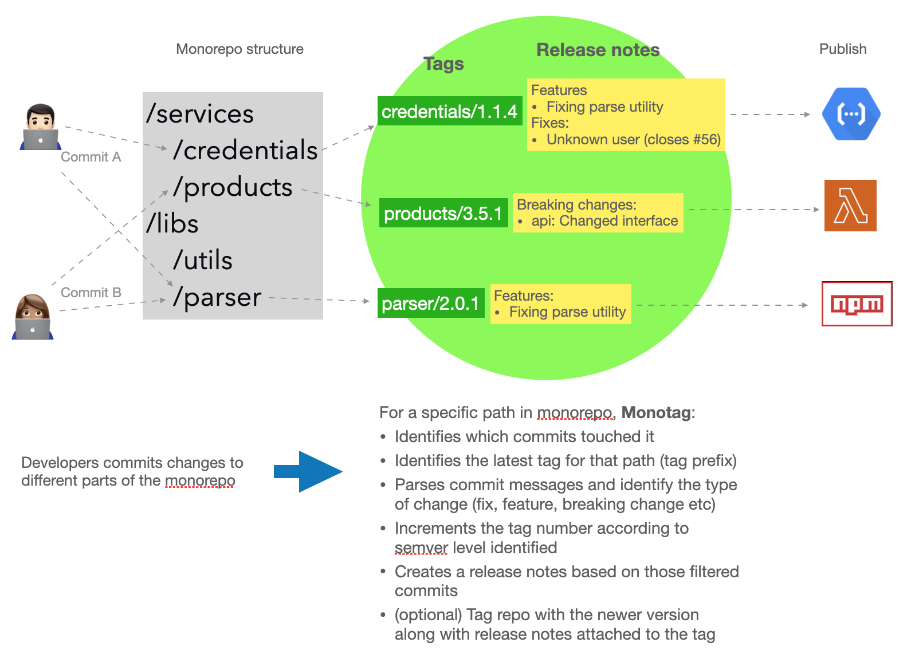

# monotag

Semantic versioning for monorepos based on tag prefix, path prefix, affected files and conventional commit.

This lib can help you tag changes in specific parts of the monorepo using tag prefixes or publishing libs or deploying services independently, even though they reside in a single monorepo.

Normally this is not easy because the monorepo shares the entire commit history and to identify which commits touched a specific dir requires some sort of filtering.



Run 'npx monotag --help' or 'npx monotag tag --help' for info on specific commands

The automatic versioning feature can be used for non-monorepos too and you can use this as a library also. Check examples below.

## Example

A monorepo has the following structure:

```
/services
   /my-service1
   /my-service2
/libs
   /my-lib1
   /my-lib2
```

The team will commit and merge things to the "main" branch changing files in all those modules, so your commit log might be:

```
2023-01-01: feat: adding new API call to google <-- this touched service1 and lib2
2023-01-01: feat: new interface to lib2         <-- this touched lib2 and service2
2023-01-03: fix: bug fix according to #43       <-- this touched service2
2023-01-04: feat!(lib1): upgrading interface    <-- this touched lib1
```

We want to tag and create a release notes for lib1 before publishing to NPM and a release notes to service2 before deploying it to production. All commits are mixed together because the team was working with things integrated (which is an advantage of using a monorepo actually).

For creating the tags and release notes you can run:

```
npx monotag tag --path=libs/my-lib1
# will return "my-lib1/2.0.0" as tag along with "Features: -upgrading interface"
# (if latest tag was my-lib1/1.4.3, for example)

npx monotag tag --path=services/my-service2
# will return "my-service2/1.3.0" as tag along with "Features: -new interface to lib2; Fixes: -bug fix according to #43"
# (if latest tag was my-service2/1.2.9 and a minor change was detected, for example)

npx monotag tag --path=services/my-service2 --prerelease=true
# will return "my-service2/1.3.0-beta.0" as tag along with "Features: -new interface to lib2; Fixes: -bug fix according to #43"
# (if latest tag was my-service2/1.2.9 and a minor change was detected, for example)

```

See a complete github actions workflow that publishes libs to NPM with automatic versioning and release notes generation in a monorepo using monotag [here](https://github.com/flaviostutz/monotag/blob/1.0.14/.github/workflows/create-next-tag.yml)

## Usage

### CLI

```text
monotag [command]

Commands:
  monotag latest    Show latest tag for path. If path has tags 1.2.0 and 2.1.1,
                    for example, 2.1.1 will be returned
  monotag tag       Calculate and show next tag, incrementing semver according
                    to detected changes on path
  monotag notes     Calculate and show release notes according to detected
                    commits in path
  monotag tag-git   Calculate next tag and tag it in local git repo
  monotag tag-push  Calculate next tag, git-tag and git-push it to remote

Options:
  --version  Show version number                                       [boolean]
  --help     Show help                                                 [boolean]
```

### Lib

```ts
import { nextTag, releaseNotes, lastTagForPrefix, filterCommits, summarizeCommits } from 'monotag';
```

- nextTag - calculates next tag
- releaseNotes - calculates only release notes based on a commit range on a prefix
- lastTagForPrefix - find latest tag for a certain tag prefix name
- filterCommits - find commits that touches a certain path in a range
- summarizeCommits - gets a list of commits and summarize them according to the conventional commit classification

Check http://github.com/flaviostutz/monotag/src/ for more details.

The library exposes its ts types, so you can use VSCode for auto completing and seeing jsdoc for types.

## Examples

### CLI example

- `monotag tag`
  - Will use current dir as repo and tag prefix name, try to find the latest tag in this repo with this prefix, look for changes since the last tag to HEAD and output a newer version according to conventional commit changes. If
  there are not changes since the last tag, the latest tag will be returned.

- `monotag tag --version-file=dist/version.txt --notes-file=dist/notes.md --tag-file=dist/versiontag.txt`
  - Same as previous, but saves the version part of the tag in version.txt, the full tag name in versiontag.txt and the version change notes in dist/notes.md

- `monotag tag --changelog-file=docs/changelog.md`
  - Calculates next tag and add the release notes of the version to the existing docs/changelog.md file by appending the contents of the version notes to the top of the file so that this file will contain a history of versions.

- `monotag tag --min-version=2.0.0 --max-version=2.999.999`
  - Limit the generated versions to 1.x. If the calculated version is lower than 2.x, force to 2.0.0. If the generated version is higher than 2.x (due to a major change), fail. Useful when controlling versioning on specific major release branches (e.g.: branch 2.x).

- `monotag current`
  - Will get the latest tag for current path and check if it's the latest possible tag in the repo. It will fail if there are changes in the repo that would lead to the creation of a new tag. If the latest tag is the latest possible (current), then it will be returned.
  
- `monotag notes --from-ref=HEAD~3 --to-ref=HEAD --path services/myservice`
  - Generate release notes according to changes made in the last 3 commits for changes in dir services/myservice of the repo

- `monotag tag --path services/myservice`
  - Generate tag "myservice/1.3.0" if previous tag was "myservice/1.2.8" and one commit with comment "feat: adding something new" is found between commits from the latest tag and HEAD

- `monotag tag --path services/myservice --separator=/v`
  - Generate tag "myservice/v1.3.0" if previous tag was "myservice/v1.2.8" and one commit with comment "feat: adding something new" is found between commits from the latest tag and HEAD

- `monotag tag --path services/myservice --prerelease`
  - Generate tag "myservice/1.3.0-beta.0" if previous tag was "myservice/1.2.8" and one commit with comment "feat: adding something new" is found between commits from the latest tag and HEAD

### Github actions workflow

- Create file .github/workflows/create-next-tag.yml in your repo

```yml
name: create-next-tag

on:
  workflow_dispatch:

jobs:
  create-tag:
    runs-on: ubuntu-latest
    permissions:
      # needed for pushing new tag
      contents: write
    steps:
      - uses: actions/checkout@v3
        with:
          fetch-depth: 0
          # this is needed if you want the tag push to trigger another workflow
          # create a personal token and set a secret with name GH_PERSONAL_TOKEN
          # https://github.com/orgs/community/discussions/27028
          token: ${{ secrets.GH_PERSONAL_TOKEN }}
      - name: Create tag and push to repo
        run: |
          git config --global user.email "flaviostutz@gmail.com"
          git config --global user.name "Flávio Stutz"
          npx -y monotag@latest tag-push
```

- Push this file to the repo. A new action will be available to be triggered manually on GH

- When you have a release candidate and want to tag it, go to Github -> repository -> Actions -> (on the left) "create-next-tag" -> Hit "Run workflow"

- It will get the last tag, create release notes, increment semantic version, tag repo and push it automatically

### Lib example

- Having a repo with structure

```text
/modules
   /mymodule
   /another-one
```

- Existing tags:
  - mymodule/1.6.2,
  - mymodule/2.4.7,
  - another-one/0.3.5
- Existing commits after latest tag:
  - feat(ui): Cache capability <-- changed mymodule/ files
  - feat!: Upgrading API interfaces <-- changed another-one/ files

```ts
import { nextTag } from 'monotag';

const nt = await nextTag({
  repoDir: 'repos/myrepo',
  toRef: 'HEAD',
  path: 'modules/mymodule',
});

console.log(nt.tagName);
// shows "2.5.0"
console.log(nt.releaseNotes)
// shows "Features: -ui: Cache capability"
```

- What happened:
  - default tag prefix is the name of the path: 'mymodule'
  - find latest tag with prefix 'mymodule/': 'mymodule/2.4.7'
  - find commits from the latest tag to HEAD
  - filter out commits that didn't touch files in path 'modules/mymodule', only one commit touched
  - check the commit message and look for conventional commit patterns. It found prefix 'feat', which is related to a new feature, so semver will be incremented in minor level
  - Latest tag was mymodule/2.4.7, incrementing minor gives 'mymodule/2.5.0'

